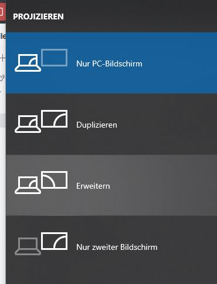
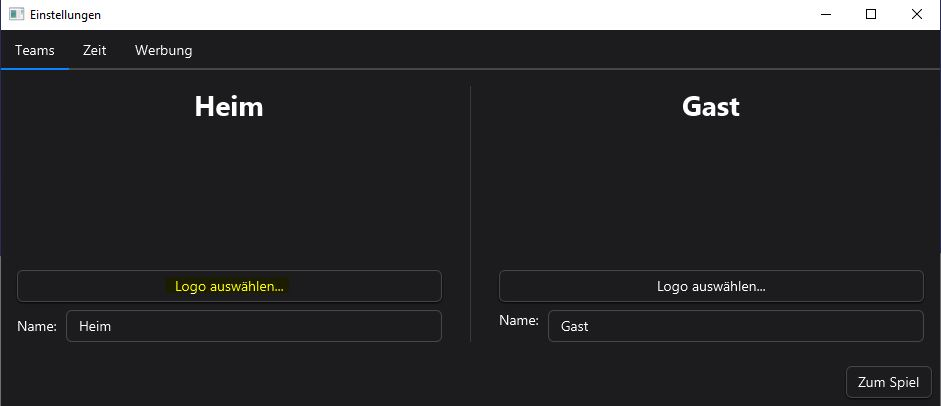
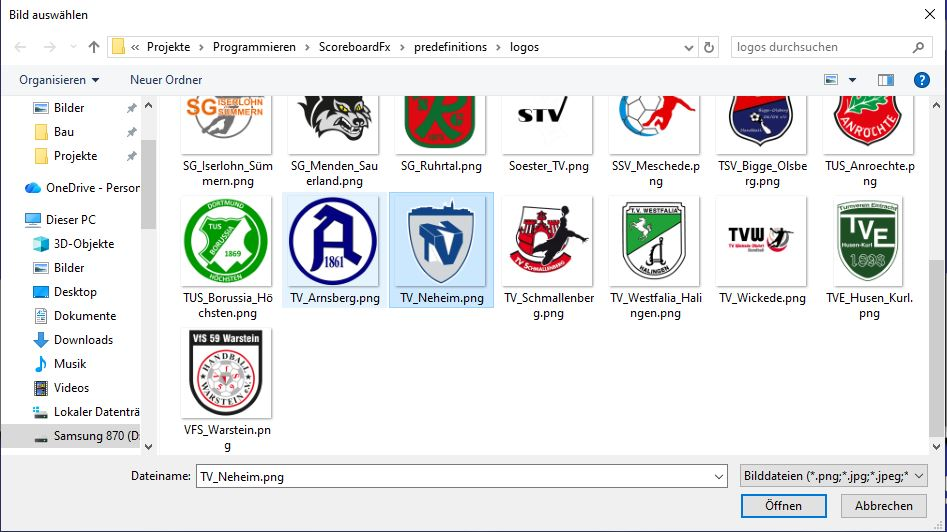
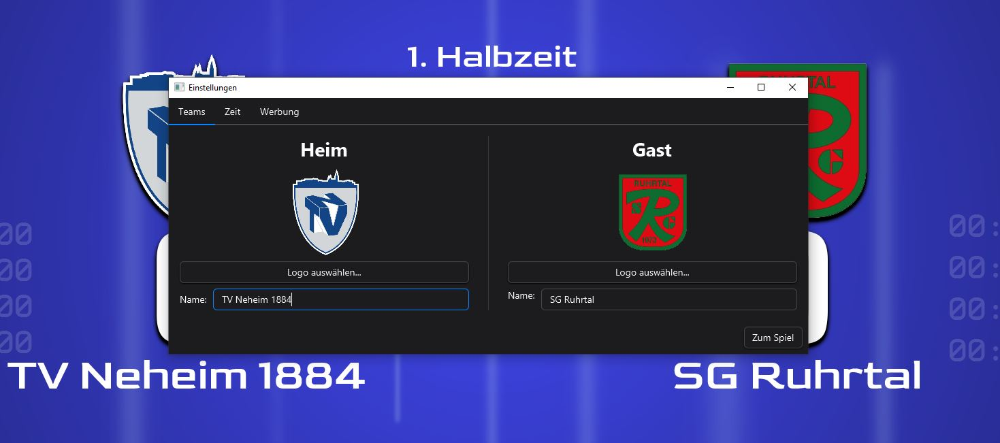
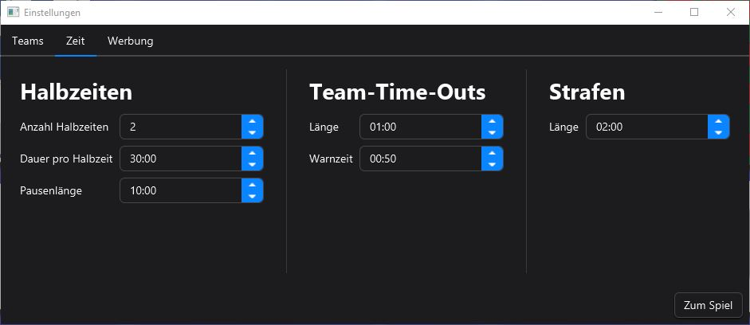
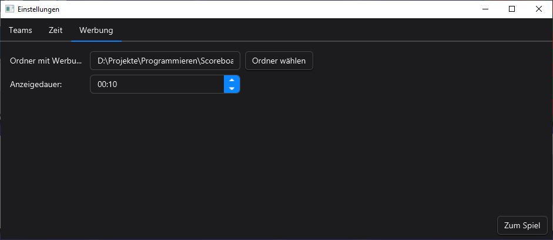
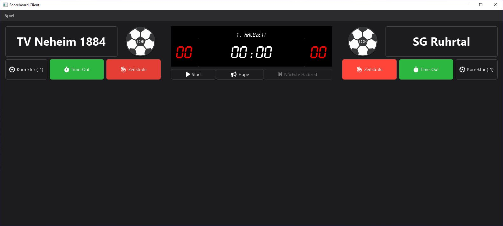
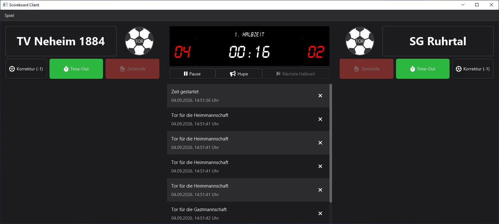
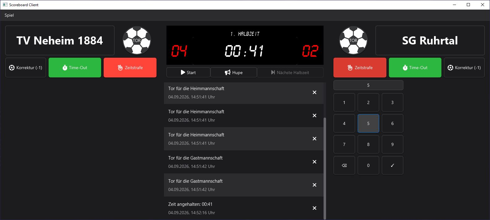
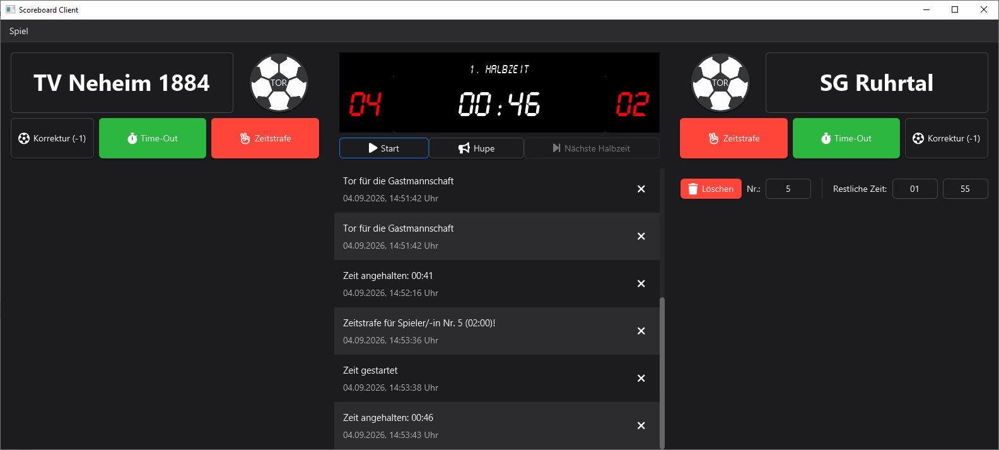

# Scoreboard FX
Scoreboard FX ist eine Software, die dem Zweck einer Anzeigentafel für Handballspiele dient.

***

## Starten

### Allgemein

Vor dem Starten der Software sollte der Beamer mit dem Laptop über ein HDMI-Kabel verbunden werden.
Damit das Scoreboard auf dem Beamer vollflächig angezeigt werden kann, muss über Windows-Taste + P "Erweitern" ausgewählt werden:

### Starten als ausführbare Datei
Auf dem Desktop ist eine Verknüpfung hinterlegt. Hierüber kann die Anwendung einfach per Doppelklick gestartet werden.

### Starten über die Entwicklungsumgebung

#### Entwicklungsumgebung öffnen
Öffne die Entwicklungsumgebung "IntelliJ" auf dem Desktop

#### Projekt auf den neuesten Stand bringen
In IntelliJ den Menüpunkt "Git" und dann "Pull" auswählen. Nochmal mit "Pull" bestätigen. 
Das Projekt ist jetzt auf dem neuesten Stand.

#### Die Software starten
In der rechten Ecke ist ein Play-Symbol (Dreieck). Hierüber kann die Software gestarten werden.
Neben dem Symbol sollte "ScoreboardFC [run]" ausgewählt sein.

#### Einstellungen
In den Einstellungen können Logos und Teamnamen festgelegt werden. Am besten nimmt man hier kurze Teamnamen
(beispielsweise "HVE" statt "HVE Villigst Ergste"), damit diese nicht zu lang dargestellt werden.

***

## Einstellungen

Zunächst öffnen sich die Einstellungen, wo Team-, Zeit- und Werbeeinstellungen vorgenommen werden können.

### Logos und Teamnamen

Über den Button "Logo auswählen" können Logos für die Teams von einem beliebigen Ordner geladen werden. 
Im besten Fall haben die Logos einen transparenten Hintergrund und eine gute Auflösung.

Auch die Namen der Teams können angepasst werden. Die Änderungen sollten auch direkt auf der Anzeigetafel sichtbar werden.
Zu lange Namen sollten aus Designgründen vermieden werden!

### Zeiteinstellungen

Hier können die Halbzeit-, Pausen-, Time-Out- und Strafenlängen angepasst werden.
Im Normalfall passen die Standardeinstellungen. 

Beachte aber die Dauer der Halbzeit für die unterschiedlichen Altersklassen:

| Altersklasse |   Dauer |
|--------------|--------:|
| E, D         | 20 Min. |
| C, B         | 25 Min. |
| A, Senioren  | 30 Min. |

### Werbeeinstellungen

Hier können Ordner mit Werbebannern und die Dauer der Anzeige pro Werbung 
ausgewählt werden. Auch animierte Banner (GIFs) sind möglich!

***

## Spiel

Über "Zum Spiel" gelangt man in den sogenannten Client - einer Fernbedienung für die Anzeigentafel.

### Zeitsteuerung

Die wichtigste Schaltfläche ist "Start/Pause", über die man die Zeit starten und auch pausieren kann.
Über "Hupe" ertönt ein Geräusch, um auf sich aufmerksam zu machen.

### Tore

Über die Schaltflächen "TOR" können der Heim- oder Gastmannschaft Tore zugesprochen werden.
Über "Korrektur (-1)" können fälschlich zugewiesene Tore entfernt werden.

### Strafen

Über "Zeitstrafe" können den Mannschaften Strafen zugewiesen werden. Hierzu muss eine Spielernummer gewählt und bestätigt werden.
Ein Löschen und Anpassen von Zeitstrafen ist jederzeit möglich.

### Auszeiten

Mit einem Klick auf "Auszeit" stoppt die Zeit, ein Hupsignal ertönt, und ein Auszeit-Timer beginnt zu laufen.
Es wird automatisch nach 50 Sekunden ein Warnsignal über die Hupe ausgegeben.
Auszeiten können jederzeit wieder abgebrochen werden.